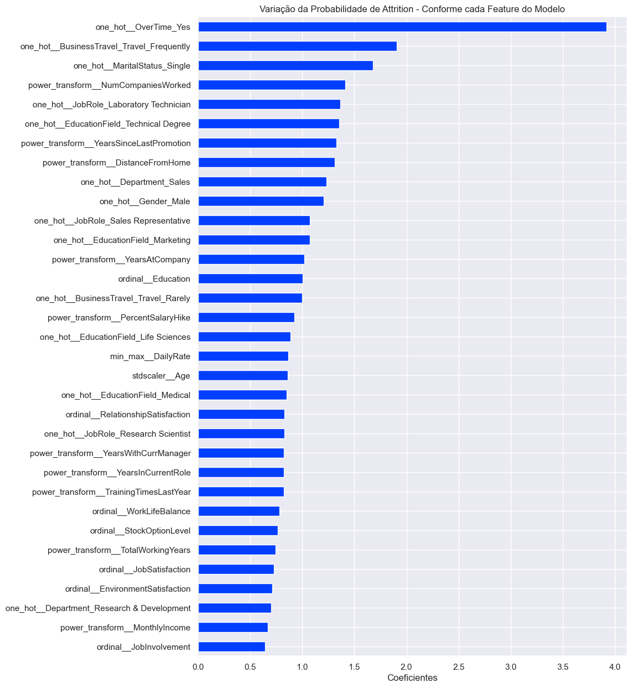

# Projeto IBM - Previsão de Atrito 

O dataset a ser utilizado é o *IBM HR Analytics Employee Attrition & Performance*, disponível no Kaggle. O dataset contém informações sobre funcionários de uma empresa fictícia, como idade, gênero, estado civil, nível de satisfação, entre outros. O objetivo é prever a probabilidade de um funcionário sair da empresa.

[Link do Kaggle](https://www.kaggle.com/datasets/pavansubhasht/ibm-hr-analytics-attrition-dataset/data)

## Conceito de Atrito

Os termos *attrition* ("atrito") e *turnover* ("rotatividade") são frequentemente usados de forma intercambiável no contexto de recursos humanos e gestão de força de trabalho, mas eles se referem a conceitos ligeiramente diferentes.

Atrito refere-se à redução gradual de empregados por meio de circunstâncias naturais, como aposentadoria, demissão voluntária por motivos pessoais, ou a decisão de não substituir empregados que estão de saída. 

## Considerações sobre o projeto - Linha de Raciocínio

Primeiramente foi feito a análise exploratória da base original para entender as features compostas na base, fazendo também um tratamento inicial dos dados. Buscamos entender também como funcionava a distribuição dos dados de cada feature numérica do modelo, bem como a presença de outliers para cada feature, e como cada feature se comportava nas 2 situações alvo do projeto (funcionários que saíram da empresa e que não saíram conforme dados da coluna Attrition). Além disso, analisamos as correlações existentes entre as features do modelo, exportando a base de dados tratada para ser usada nos notebooks em que foi criado os modelos de machine learning. 

Com a base de dados tratadas, criamos os notebooks em que foram definidos os modelos de classificação treinados pelos dados, a fim de obtermos o melhor modelo (ou modelo otimizado) para esse projeto. Foi tomado o cuidado de fazer o preprocessamento dos dados de acordo com as características dos dados de cada feature, e criado um dicionário de modelos de classificação (envolvendo modelos de árvore de decisão, regressão logística, vizinhos mais próximos e support vector machine) que seriam treinados pelos dados e através de métodos de validação cruzada obteríamos métricas que nos ajudariam a escolher qual modelo seriam escolhido para otimização dos parâmetros com "grid_search". 

A métrica escolhida definir o melhor modelo foi a average_precision, que nada mais é que a área sobre a Curva de Precisão-Recall, uma vez que entendemos que tanto o recall quanto a precisão seriam importantes para esse estudo. Também poderia ser escolhido outras métricas, como f1-score, mas não foi o caso.

Dos modelos treinados nesses dados, 2 deles acabaram se destacando perante os demais, sendo o modelo de Regressão Logística e o SVC (Support Vector Classifier). Optamos em buscar a otimização dos parâmetros do modelo de Regressão Logística e na grade de parametros (param_grid) foram incluídos parametros que seriam responsáveis pela regularização dos dados (penalty, l1_ratio, C).

Outro cuidado que tivemos durante o projeto foi trabalhar com a coluna alvo desbalanceada (pois funcionários que positivos para o Attrition, isto é, que deixaram a empresa são minoria). Para isso, foi adotado 3 estratégias:
  - Usado parametros como "class_weight=balanced" em alguns modelos e scale_pos_weight para modelos de árvore de decisão - está presente no arquivo "02.1_Modelos_Class_Weight_Balanced.ipynb"
  - Usado o método RandomUnderSampler, que equilibra a variável target reduzindo aleatoriamente o numero de amostras da classe majoritária - está presente no arquivo "02.2_Modelos_Balanceamento_RandomUnderSampler.ipynb"
  - Por fim, foi usado o método RandomOverSampler, que equilibra a variável target aumentando aleatoriamente o numero de amostras da classe minoritária - está presente no arquivo "02.2_Modelos_Balanceamento_RandomOvererSampler.ipynb".

Dos 3 notebooks acima aquele cujo resultado foi o melhor foi o notebook "02.2_Modelos_Balanceamento_RandomOvererSampler.ipynb" em que foi usado o método RandomOverSampler para balancear os dados do target.

Uma vez escolhido e otimizado o modelo de Regressão Logística tentei identificar quais features teriam maior relevância da determinação do Atrito, com o auxílio dos coeficientes da regressão logística para cada feature. Foi adotado o conceito de Log-Odds com o objetivo de transformar os coeficientes de cada feature na probabilidade que cada feature tem em influenciar o target (Atrito de cada funcionário). Isso pode ser observado na imagem "Variacao_probabilidade_attrition.png" da pasta "relatorios".

A partir dessa imagem é sugerido um plano de ação para que a empresa possa entender os motivos que levam ao atrito e tomar ações para evitar isso.

## Plano de Ação

- Avaliar os motivos que levam os funcionários a fazerem hora extra que podem influenciar no Attrition
    - Mão de obra insuficiente
    - Falta de organização institucional
    - Falta de treinamento
    - Necessidade de investimento em tecnologia
- Existe a possibilidade de diminuir ou limitar as viagens de negócios?
    - Como isso pode afetar alguns departamentos (ex: vendas)?
    - O que pode tornar as viagens de negócio um motivo para saída da empresa?
- Como a renda mensal de cada setor em nível da empresa se compara ao mercado?
- Quais as ações a empresa pode promover para aumentar o envolvimento e a satisfação do funcionários? Principalmente nos departamentos com maior probabilidade de Attrition?

## Simular Probabilidade de Atrito - Streamlit

Com o projeto citado acima foi exportado o melhor modelo obtido, e criado uma página do streamlit com arquivo "home_streamlit.py", para que seja possível fornecer as informações de cada funcionário e o modelo calcular a probabilidade do funcionário sair da empresa, permitindo simulações que possam ser úteis para a empresa. 

Esse arquivo usado no streamlit usa o modelo de classificação exportado através do notebook "02.2_Modelos_Balanceamento_RandomOvererSampler.ipynb".

# Organização de pastas e arquivos do projeto

├── dados              <- Arquivos de dados originais e tratados para o projeto.

├── modelos            <- Modelos treinados, otimizado e extraído do projeto.

├── notebooks          <- Cadernos Jupyter onde foi desenvolvido o projeto de previsão de atrito

|   └──src             <- Código-fonte para uso neste projeto.
      
       └── __init__.py         <- Torna um módulo Python os arquivos abaixo
       └── config.py           <- Definido caminho onde os principais arquivos do projeto estão salvos
       └── graficos.py         <- Scripts para criar visualizações gráficas e orientadas a resultados dos modelos
       └── models.py           <- Scripts com fórmulas para criação, treino, e verificação dos resultados dos modelos 
       └── models_rus.py       <- Scripts com fórmulas para criação, treino, e verificação dos resultados dos modelos incluindo etapa de RandomUnderSampler
       └── models_imlearn.py   <- Scripts com fórmulas para criação, treino, e verificação dos resultados dos modelos incluindo etapa de balanceamento genérico do target
       └── auxiliares.py       <- Scripts para criar dataframe dos coeficientes do modelo escolhido

├── referencias        <- Dicionários de dados, manuais e todos os outros materiais explicativos.

├── relatorios         <- Análises geradas em HTML, PDF, Imagens, etc.

├── .gitignore         <- Arquivos e diretórios a serem ignorados pelo Git

├── ambiente.yml       <- O arquivo de requisitos para reproduzir o ambiente de análise
